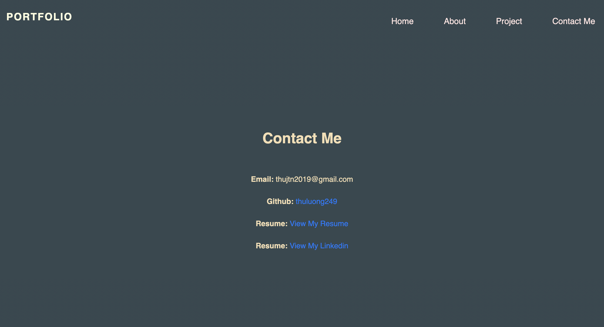

# Updated Portfolio 

For this homework I modified the old homework I have build before. The first portfolio I used HTML and Styles CSS, links and style them. 

This time I have been using a little bit of Bootstrap in this asignment, using the color that I have found on google.com not only from bootstrap. 

Updated all the page and added my full name, email and phone numbers. Added the links to the first project I have created with my classmates plus the other two homeworks from my github page. 

For the Github page I have updated with pinned the repositories for the page. Added profile picture, Bio, current location, email and link to my deployed Portfolio page.

Customize the size of the page for viewing on a different devices. 

Biside I have updated my resume and Linkedin, links them to the Portfolio page.

Visit my page => [here](https://thuluong249.github.io/Homework8/)

## Screnshot about my new Portfolio page:

---

Home page 

---

About Me 

---

Projects

---

Contact info

---

## Contact
**Thu Luong** [Email](mailto:thujtn2019@gmail.com)
---
My [Github](https://github.com/thuluong249)
